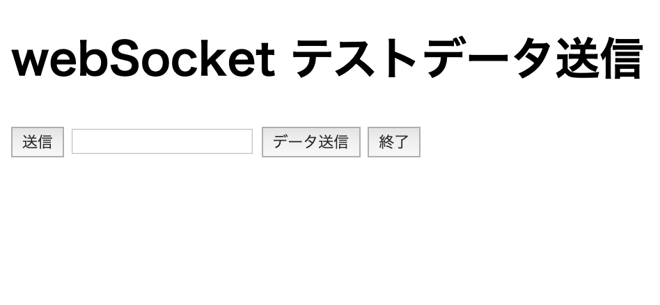
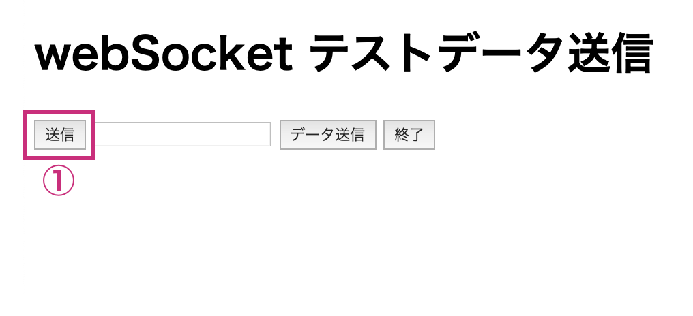
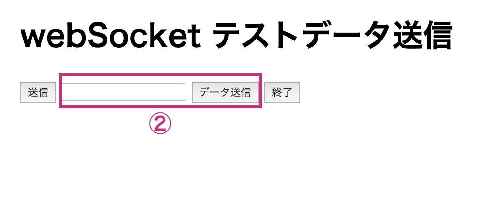
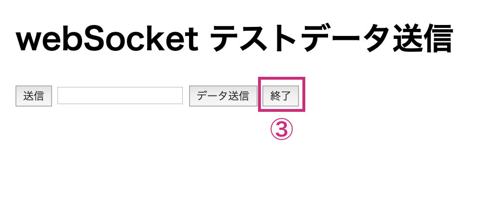

# Dr.NA_wsTest

name : Masakatsu Shibata

## ■ 接続準備

`index.html` の下記コードをwebSocket のサーバを指定してください。

``` js
const ws = new WebSocket('ws://localhost:8080');
```

## ■ 運用

webSocketでのテストデータ(JSON形式)を送信します。



### ● アニメーション起動

アニメーション起動用のデータを送信します。



- データ形式

    ``` json
    {
        "type": "result",
        "pulse": {
            "avg": 65,
            "datas":[
                80,
                75,
            ]
        },
        "height": 175,
        "sick": {
            "name": "病気名",
            "place": 1,
            "message": "病気説明"
        }
    }
    ```

### ● アニメーション中のメッセージ送信

アニメーション起動時のメッセージを送信します。<br />
テキストエリアにメッセージを入力してください。



- データ形式

    ``` json
    {
        "type": "message",
        "message": "メッセージ"
    }
    ```

### ● アニメーション終了

アニメーションの終了メッセージを送信します。



- データ形式

    ``` json
    {
        "type": "Animation END",
        "message": "End of diagnosis"
    }
    ```

## ■ 注意

webSocketサーバは含まれていないので別途準備すること。

<p>&copy;2020 Dr.NA_wsTest</p>
